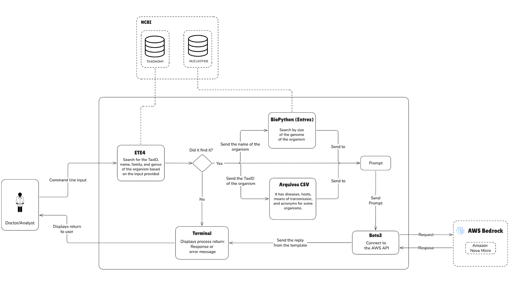

## Summary

Bio-J.A.R.V.I.S. is an open-source tool that generates standardized, clinician-oriented interpretation text from clinical metagenomics (mNGS) pathogen identifications, addressing the “final-mile” reporting bottleneck that still requires substantial manual expertise. It operates downstream of existing mNGS pipelines and portals as a workflow-agnostic interpretation layer: given a TaxID or organism name, it resolves the taxon, retrieves organism trusted knowledge from public reference databases (notably NCBI and ViralZone), and combines this evidence with clinician-authored exemplar texts in structured prompts to constrain an LLM toward factual, low-variance outputs. The software has been evaluated through structured A/B testing with physicians and clinical analysts, is available both as a public GitHub repository and a web application, and ships curated datasets (CSV resources and prompt shots) to support reproducible, community-ready deployment and adaptation across clinical mNGS workflows.

## Statement of need

Clinical metagenomics (mNGS) has substantially transformed infectious disease diagnostics by enabling the simultaneous detection of multiple pathogens directly from clinical samples (blood, cerebrospinal fluid, nasopharyngeal swab, etc.). Despite these advances, interpretation of metagenomic results remains a critical bottleneck, particularly in culture-negative infections, rare or emerging pathogens, and complex clinical scenarios [@chiu2019clinical]. In practice, translating a taxonomic identification into a concise, clinically oriented narrative still requires substantial manual effort and domain expertise, as illustrated by our diagnostic experiences with emerging arenaviruses and hantaviruses infections [@demellomalta2020sabia; @seara2024hantavirus].

Bio-J.A.R.V.I.S. targets clinical laboratory professionals and clinical microbiology/infectious disease teams who need to communicate metagenomic findings as standardized interpretive text in routine reporting workflows. Existing mNGS pipelines and platforms typically focus on bioinformatics processing, taxonomic classification, and result exploration. However, they do not provide an open, reusable layer dedicated to generating clinician-oriented interpretation text grounded in reference knowledge. 

Here we present a stand-alone tool that was developed to streamline this downstream interpretive step by automatically generating standardized clinical interpretation text from taxonomic identifications. The tool retrieves organism metadata from public reference databases and combines these facts with clinician-authored example texts to guide generation through structured prompting. To support clinical reporting requirements, Bio-J.A.R.V.I.S. is designed to minimize variability and prioritize factual consistency while producing clear and reproducible interpretations that can be integrated into routine diagnostic workflows.

## State of the field

Clinical metagenomics software ecosystems have matured around core analytical steps such as host filtering, quality control, taxonomic classification, assembly, alignment, and interactive result exploration. Representative examples include end-to-end pipelines and portals such as IDseq [@kalantar2020idseq], as well as widely used classifiers such as Kraken2 [@wood2019kraken2] and clinical-focused pipelines such as SURPI [@naccache2014surpi]. These tools are essential for producing validated organism detections and summarizing evidence (e.g., reads/contigs assigned to taxa, abundance estimates, and supporting alignments). 

However, the “final-mile” step of converting a taxonomic call into a clinician-oriented interpretation narrative (e.g., organism context, disease it causes, transmission, host range, and reporting-relevant caveats) is still typically handled manually. This gap becomes more acute as sequencing volumes increase and diagnostic workflows demand fast, standardized, and reproducible interpretations—particularly for culture-negative cases and rare or emerging pathogens, where interpretation requires careful contextualization beyond a taxon label. 

Bio-J.A.R.V.I.S. addresses this specific missing layer by operating downstream of existing pipelines: it takes taxonomic identifications as input and generates standardized clinical interpretation text grounded in public reference databases. Rather than extending a single portal or pipeline, Bio-J.A.R.V.I.S. is designed as a portable, open, workflow-agnostic component that can integrate with outputs from multiple classifiers and platforms. The scholarly contribution is not another taxonomic workflow, but a reproducible mechanism for grounded narrative generation suitable for clinical communication, decoupled from any one analysis stack.

## Software Design

Bio-J.A.R.V.I.S. is designed as a downstream “interpretation layer” that converts validated taxonomic identifications generated by bioinfomatics pipelines into clinician-oriented narrative text. The central design trade-off is between fluency and clinical reliability: unrestricted generation can produce polished but unstable or poorly grounded statements, while rigid templates can become brittle and hard to maintain. Bio-J.A.R.V.I.S. addresses this by grounding generation in external reference knowledge and by constraining model behavior through structured prompting engineering.

The architecture separates the workflow into (i) taxon resolution, (ii) evidence retrieval, and (iii) controlled text generation. Users provide a TaxID or organism name; the system resolves the organism against NCBI Taxonomy [@ncbitaxonomy2012] and retrieves structured metadata from the public reference sources NCBI [@benson2005genbank] and ViralZone [@hulo2011viralzone], complemented by curated project CSVs and clinician-authored exemplar texts. This evidence is assembled into a structured prompt (including two-shot examples) and passed to an LLM through a provider-agnostic interface, configured for low-variance output to improve reproducibility across runs.

Attribute selection reflects clinical reporting needs observed during interviews and prior textual analysis: organism name, disease, modes of transmission, hosts, genome size (bp), family, genus, and acronym (when available). Prompt variants were evaluated via clinician/analyst A/B testing; full methods and analyses are provided as a jupyter notebook in the repository. The resulting design intentionally complements existing metagenomics pipelines by keeping interpretation logic modular, portable, and decoupled from any single analysis stack.

## Research Impact Statement

Bio-J.A.R.V.I.S. provides an open and reusable “interpretation layer” for clinical metagenomics: given a validated taxonomic identification, it generates clinician-oriented interpretation text grounded in public reference sources. The software has already been evaluated via structured A/B testing with physicians and clinical analysts, indicating high user acceptance and practical potential to streamline interpretative workflows in routine mNGS reporting. 

To support real-world adoption beyond a single lab environment, Bio-J.A.R.V.I.S. is released as open-source software with documentation and example usage in a public GitHub repository, and it is also available through a web application that exposes the same configurable parameters for interactive use. 

## AI Usage Disclosure

Bio-J.A.R.V.I.S. uses third-part large language model at runtime to generate clinical interpretation text from structured prompts grounded in public reference databases and curated resources. During development, generative AI tools were also used to draft code, documentation and manuscript text; all AI-assisted prose was reviewed and edited by the authors for correctness, clarity and accuracy. The example texts (provided as prompt shots) were exclusively written by a physician or clinical analyst. Feedbacks to prompt engineering were also provided by physicians and clinical analysts. Factual organism attributes included in prompts were sourced from public reference databases (e.g., NCBI and ViralZone) rather than generated freely by the model.

## Data and Code Availability

The full source code for Bio-J.A.R.V.I.S., including documentation and example usage, is openly available on GitHub at
[https://github.com/omicsintellab/Bio-J.A.R.V.I.S](https://github.com/omicsintellab/Bio-J.A.R.V.I.S).
It is also possible to use Bio-J.A.R.V.I.S as a Web application available at: [https://biojarvis.omicsintel.com/](https://biojarvis.omicsintel.com/)

Bio-J.A.R.V.I.S. includes curated CSV files containing organism metadata and clinician-authored interpretative texts used to inform the prompting strategy of the generative model. These datasets are publicly available within the project’s GitHub repository. In addition, the tool retrieves organism information from publicly accessible NCBI resources, including NCBI Entrez [@baxevanis2006searching] and the NCBI Taxonomy database via ETE4 [@huerta2016ete], and from Viral Zone datasets [@hulo2011viralzone], ensuring full reproducibility of the workflow.

## Acknowledgements

This study was financed, in part, by the São Paulo Research Foundation (FAPESP), Brasil. Process Number #2024/17790-9. We thank physicians, clinical analysts, and students for their valuable input and feedback. We also thank the Clinical Laboratory of the Hospital Albert Einstein for their support.

## References
